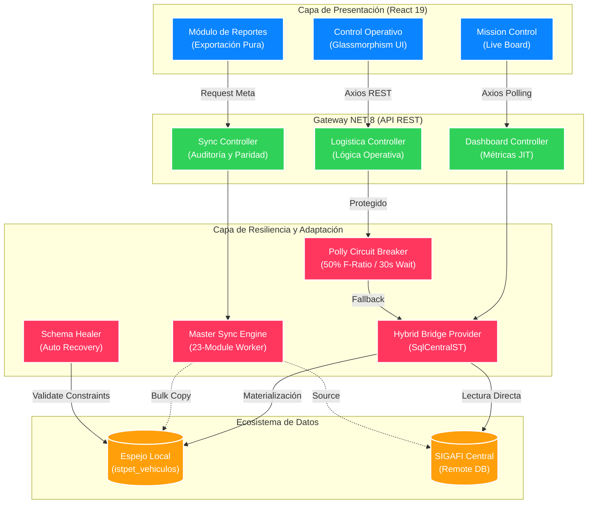

# Arquitectura del Sistema — ISTPET Logística (Versión Final 2026)

## 1. Visión Holística

El sistema ISTPET Vehículos está diseñado bajo un paradigma de **Arquitectura de Puente Híbrido Universal**. No es simplemente un front-end para una base de datos local; opera interceptando, fusionando y materializando datos desde la infraestructura central `SIGAFI` mientras mantiene un motor masivo de contingencia local. 

> [!TIP]
> **Modo Directo Recomendado:** Para garantizar la paridad académica en todo momento, el sistema se ejecuta en **Modo Directo**. La lógica `JIT` (Just-In-Time) asegura que ningún fallo de sincronización previo limite la gestión operativa actual.

### Pilares Fundamentales:
*   **Switchable Data Path**: Soporte nativo para operaciones en tiempo real (`Direct`) y operaciones aisladas (`Mirror`).
*   **Master Sync Engine**: Un motor iterativo asíncrono de **23 Módulos** que replica el ecosistema académico y logístico para Alta Disponibilidad (HA).
*   **Zero-Downtime Resilience**: Orquestación de *Circuit Breakers* mediante Poly, evadiendo colapsos en cascada ante deficiencias de red.
*   **Schema Healer & Parity**: Auto-reparación estructural (`Database.EnsureCreated`) con protección contra degradación de esquemas.

---

## 2. Diagrama de Arquitectura de Misión Crítica

---

## 3. Componentes Estratégicos

### 3.1. Hybrid Universal Bridge (`SqlCentralStudentProvider`)
El motor de puente híbrido ejecuta consultas asíncronas JIT. Si se requiere un estudiante que no figura en la base local (p.ej., recién matriculado), el *Bridge* extrae el grafo técnico de SIGAFI (Nivel, Período, etc.) y ejecuta un *Upsert* silente en el espejo local.

### 3.2. Master Sync Engine (`DataSyncService`)
Esecuta 23 transacciones de bloque secuenciales:
- `Pasos 1-10`: Estructura Académica (Carreras, Mallas, Cursos, Estudiantes).
- `Pasos 11-15`: Gestión Operativa (Instructores, Vehículos Operativos).
- `Pasos 16-23`: Planificación y Seguridad (Asignaciones de horarios, Usuarios).

### 3.3. Resilience Pipeline (Polly)
El sistema encapsula la conexión a SIGAFI bajo un pipeline reactivo:
- **SamplingDuration**: `10s` (Mide salud en las últimas transacciones).
- **FailureRatio**: `0.5` (Permite hasta 50% de error antes de romper circuito).
- **BreakDuration**: `30s` (Aísla fallos de servidor central temporalmente garantizando UX fluida y previniendo `Thread Pool Starvation`).

---

## 4. Patrones de Diseño Implementados

| Categoría | Patrón | Implementación Analítica |
| :--- | :--- | :--- |
| **Estabilidad** | Circuit Breaker | `SigafiResiliencePipeline` bloquea llamadas iterativas si la central sufre colapsos, emitiendo respuestas de resguardo. |
| **Ingeniería de Datos**| JIT Materialization | `EstudianteLogisticaResponse` inyecta filas al vuelo para estudiantes no persistidos en la base local. |
| **Gobernanza** | Standby HA Mode | `SigafiMirrorBackgroundService` permanece en el pipeline del host en modo inactivo; listo para actuar si se revierte a modo espejo. |
| **Deduplicación**| Reconciliación Selectiva | `SigafiLocalReadMerge` utiliza llaves combinadas priorizando los timestamps de llegada en caso de choques. |

---

## 5. Diseño Front-End (Glassmorphism & UX)

El cliente web utiliza **React 19** aprovechando el renderizado concurrente. 
- **Estética Inmersiva**: Los paneles utilizan `backdrop-blur-*` sobre componentes para crear jerarquía visual contra fondos oscuros.
- **Optimistic Rendering**: El UI reacciona instantáneamente a click en "Salida" mientras cursa la promesa subyacente.
- **Normalización**: Abstracciones (`agendaUi.js`) evitan exponer implementaciones específicas de la API a la lógica de pintado DOM, parseando esquemas camelCase vs. SIGAFI PascalCase.
