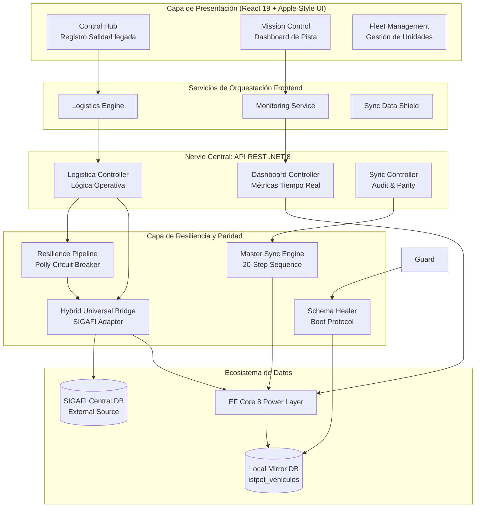

# Arquitectura del Sistema — ISTPET Logística (Industrial Grade)

## 1. Visión Holística

El sistema ISTPET Vehículos está diseñado bajo un paradigma de **Arquitectura de Puente Híbrido Universal**. No es solo una aplicación aislada, sino una extensión resiliente del ecosistema SIGAFI, optimizada para operaciones críticas de logística terrestre en tiempo real.

### Pilares Fundamentales:
*   **Dual-Database Bridge**: Sincronización bidireccional entre el espejo local (Mirror) e integridad referencial con el núcleo académico (SIGAFI).
*   **Zero-Downtime Resilience**: Implementación de *Circuit Breakers* para garantizar operatividad incluso con conectividad intermitente hacia SIGAFI.
*   **Auto-Adaptive Schema (Schema Healer)**: Protocolo de auto-sanación que garantiza la integridad estructural de la base de datos en cada arranque, con protección de escritura proactiva para entornos Directos.
*   **Variable Environment Core**: Carga nativa de configuración vía `.env` con construcción dinámica de cadenas de conexión.

---

## 2. Diagrama de Arquitectura de Misión Crítica

---

## 3. Componentes Estratégicos

### 3.1. Puente Híbrido Universal (`SqlCentralStudentProvider`)
Actúa como la **Capa de Extracción Primaria**. Realiza búsquedas paralelas en tiempo real:
1.  **Cache Local**: Si el estudiante ya existe en el espejo local (`alumnos`), retorna datos inmediatos.
2.  **JIT Fetching**: Si no reside localmente, el puente cruza hacia SIGAFI, materializa la ficha y la inyecta quirúrgicamente en el espejo local antes de responder al frontend.

### 3.2. Resilience Pipeline (`SigafiResiliencePipeline`)
Implementa el patrón de **Circuit Breaker** (Disyuntor) mediante la librería `Polly`. Si SIGAFI reporta latencia alta o errores (HTTP 5xx/Timeouts), el sistema entra en **Modo de Operación Local Aislada**, permitiendo el flujo de vehículos sin depender de la conectividad externa.

### 3.3. Schema Healer Protocol
Ubicado en el arranque de `Program.cs`, este servicio actúa como un "administrador de base de datos automatizado". Verifica la existencia de 30+ tablas y 4 vistas críticas. Si falta alguna entidad o índice, el Healer los recrea dinámicamente, eliminando la necesidad de migraciones manuales en despliegues cloud.

---

## 4. Patrones de Diseño Avanzados

| Patrón | Implementación | Función Crítica |
| :--- | :--- | :--- |
| **Mirroring Pattern** | `DataSyncService` | Mantiene paridad 1:1 con SIGAFI mientras protege los datos operativos locales en tablas auxiliares (`_operacion`). |
| **JIT Materialization** | `LogisticaController` | Sincronización bajo demanda que elimina la necesidad de pre-cargar toda la base de datos de SIGAFI. |
| **Circuit Breaker** | `SigafiResiliencePipeline` | Evita el colapso de la aplicación por fallas en dependencias externas (SIGAFI). |
| **Audit Ledger** | `SqlAuditService` | Registra no solo acciones, sino metadatos como IP y User-Agent para cada transacción crítica. |
| **Dependency Injection** | ASP.NET Core Native | Gestión desacoplada de lifetimes (Scoped para DB, Singleton para Pipelines). |

---

## 5. Estándares Operativos de Datos

El sistema cumple con el **Protocolo de Paridad SIGAFI 2026**:
- **Sanitización Obligatoria**: Truncamiento preventivo de cadenas para evitar desbordamientos en campos de `chasis`, `motor` y `observaciones`.
- **Integridad Foránea**: Las transacciones de salida solo se permiten si existe un "Triángulo de Validación": Estudiante (Matriculado) + Vehículo (Disponible) + Instructor (Activo).
- **Auditabilidad Total**: Cada registro de salida (`cond_alumnos_practicas`) genera automáticamente una entrada en el log de auditoría centralizado.

---

## 6. Iconografía y Estética (Apple Design System)
El sistema utiliza un sistema de diseño propio inspirado en SF Pro de Apple:
- **Glassmorphism**: Superposición de capas con desenfoque (`backdrop-filter`) para jerarquía visual.
- **Gráfica Reactiva**: Micro-animaciones en `VehicleCard` y transiciones de estado mediante `StatusBadge`.
- **Zero-Latency Feel**: Uso intensivo de `Search Debouncing` y estados optimistas en el frontend.
