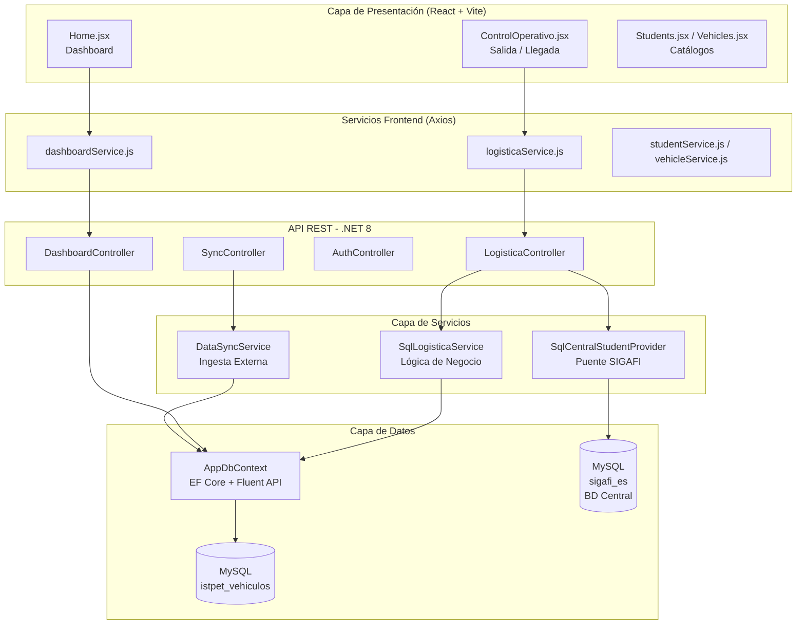
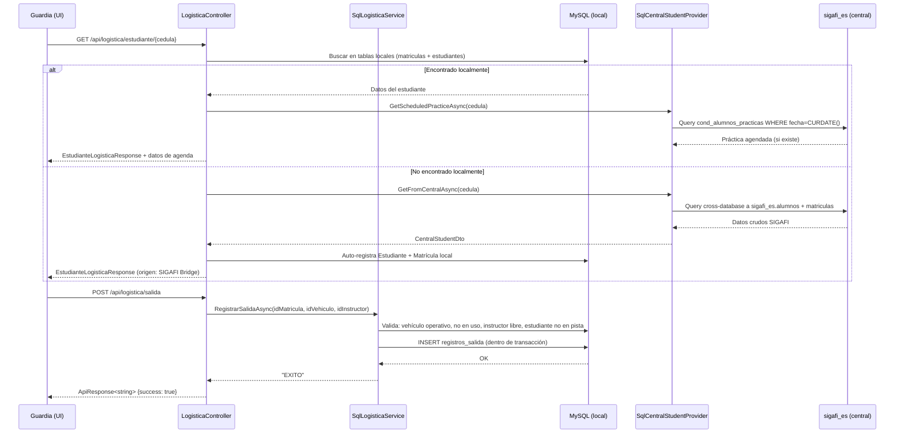

# Arquitectura del Sistema — ISTPET Logística

## Visión General

El sistema sigue una **arquitectura desacoplada por capas** (Layered Architecture) con separación estricta de responsabilidades entre el frontend, la API REST y la base de datos. Adicionalmente, incorpora un **puente de integración** con la base de datos académica central del ISTPET (sistema SIGAFI).

---

## Diagrama de Capas



---

## Estructura de Directorios

```
istpet_vehiculos/
├── backend/
│   ├── Controllers/        # Controladores REST (7 archivos)
│   ├── DTOs/               # Objetos de Transferencia de Datos
│   ├── Data/               # AppDbContext (EF Core)
│   ├── Mappings/           # Perfiles AutoMapper
│   ├── Middleware/         # Manejo global de errores
│   ├── Models/             # Entidades del dominio (13 modelos)
│   └── Services/
│       ├── Helpers/        # DataValidator (Sanitización)
│       ├── Interfaces/     # Contratos de servicio
│       └── Implementations/  # Implementaciones SQL reales
├── frontend/
│   └── src/
│       ├── components/
│       │   ├── common/     # StatusBadge, ThemeContext
│       │   ├── features/   # ActiveClasses, VehicleList, etc.
│       │   ├── layout/     # Layout, Sidebar
│       │   └── logistica/  # LogisticaHeader, VehicleCard
│       ├── pages/          # ControlOperativo, Home, Students, Vehicles
│       └── services/       # Clientes Axios por módulo
└── docs/
    └── Scripts/            # SQL_SCHEMA.sql, MOCK_SIGAFI_ES.sql
```

---

## Patrones de Diseño Implementados

| Patrón | Ubicación | Propósito |
| :--- | :--- | :--- |
| **Dependency Injection** | `Program.cs` | Registra servicios como `ILogisticaService`, `ICentralStudentProvider`, etc. Permite intercambiar implementaciones (ej: Mock vs SQL real) sin modificar los controladores. |
| **Repository / Service Layer** | `Services/Implementations/` | Encapsula toda la lógica de negocio. Los controladores delegan en servicios, no acceden directamente a la BD. |
| **DTO Pattern** | `DTOs/` | `ApiResponse<T>` estandariza todas las respuestas. Los DTOs de Logística (`EstudianteLogisticaResponse`, `VehiculoLogisticaResponse`) ocultan los detalles de las entidades del dominio. |
| **Adapter Pattern** | `SqlCentralStudentProvider.cs` | Traduce el esquema SIGAFI (nombres de tablas y columnas en camelCase) al modelo de dominio de ISTPET. |
| **Global Error Handler** | `ErrorHandlingMiddleware.cs` | Un único punto de captura para todas las excepciones no controladas, devolviendo siempre un `ApiResponse` coherente. |
| **AutoMapper** | `Mappings/MappingProfile.cs` | Transforma entidades de dominio a DTOs de forma automática y centralizada. |
| **Hybrid Auth Bridge** | `AuthController.cs` | Soporta dos algoritmos de hash (BCrypt legacy de SIGAFI y SHA-256 nativo) para garantizar compatibilidad al migrar usuarios. |

---

## Flujo Principal: Registro de Salida de Vehículo



---

## Estandarización de Respuestas API

Todos los endpoints retornan el siguiente envelope genérico:

```json
{
  "success": true,
  "message": "Operación exitosa",
  "data": { ... },
  "timestamp": "2026-04-07T03:00:00Z"
}
```

En caso de error:
```json
{
  "success": false,
  "message": "Descripción del problema",
  "data": null,
  "timestamp": "2026-04-07T03:00:00Z"
}
```

---

## Estándares de Código

- **Backend (C#)**: Nomenclatura `PascalCase` para clases, métodos y propiedades.
- **Frontend (JavaScript)**: Nomenclatura `camelCase` para variables y funciones.
- **Base de Datos (MySQL)**: Nomenclatura `snake_case` para tablas y columnas.
- **Mapeo de nombres**: Fluent API de EF Core resuelve la discrepancia entre `snake_case` (SQL) y `PascalCase` (C#).
- **Iconografía**: SVG inline (Heroicons) en el frontend. Sin dependencias de icon fonts.
