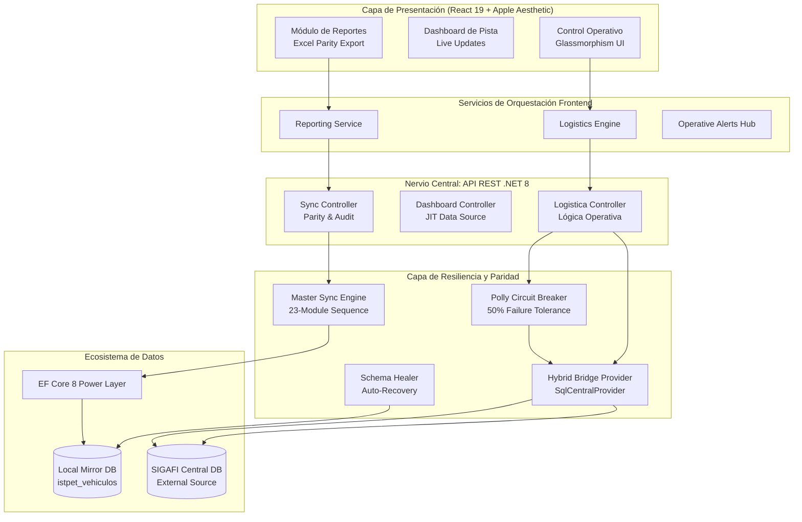

# Arquitectura del Sistema — ISTPET Logística (Versión Final 2026)

## 1. Visión Holística

El sistema ISTPET Vehículos está diseñado bajo un paradigma de **Arquitectura de Puente Híbrido Universal**. Esta arquitectura permite que el sistema opere con la agilidad de la lectura directa de SIGAFI mientras mantiene un motor de contingencia masivo en espera para garantizar la continuidad operativa ante cualquier fallo de red.

### Pilares Fundamentales:
*   **Switchable Data Path**: Soporte nativo para `Modo Directo` (Tiempo Real) y `Modo Espejo` (Alta Disponibilidad).
*   **Master Sync Engine**: Motor de sincronización integral de **23 módulos** que garantiza la replicación total de la estructura académica en el espejo local.
*   **Zero-Downtime Resilience**: Implementación de *Circuit Breakers* (Polly) que protegen la experiencia de usuario ante latencia o caídas de SIGAFI Central.
*   **Schema Healer & Parity**: Protocolo de auto-sanación que asegura que la base de datos `istpet_vehiculos` mantenga paridad absoluta con los tipos de datos de SIGAFI.

---

## 2. Diagrama de Arquitectura de Misión Crítica

---

## 3. Componentes Estratégicos

### 3.1. Hybrid Universal Bridge (`SqlCentralStudentProvider`)
Es el componente de mayor complejidad. Gestiona la conexión dual y permite la inyección de datos **JIT (Just-In-Time)**. En Modo Directo, extrae datos directamente de SIGAFI. En Modo Espejo, integra lecturas de SIGAFI con el espejo local utilizando el `SigafiLocalReadMerge`.

### 3.2. Master Sync Engine (`DataSyncService`)
Implementa un flujo de sincronización de **23 pasos individuales** que cubren:
- Estructura Académica (Carreras, Periodos, Secciones, Modalidades).
- Gestión de Flota e Instructores.
- Planificación (Horarios, Fechas, Horas de Clase, Links de Práctica).
- Seguridad (Usuarios Web y Roles).

### 3.3. Resilience Pipeline (Polly)
Utiliza una política de **Circuit Breaker** configurada para:
- **SamplingDuration**: 10 segundos.
- **FailureRatio**: 0.5 (50% de fallos).
- **MinimumThroughput**: 3 llamadas.
- **BreakDuration**: 30 segundos de aislamiento reactivo.

---

## 4. Patrones de Diseño Avanzados

| Patrón | Implementación | Función Crítica |
| :--- | :--- | :--- |
| **Circuit Breaker** | `SigafiResiliencePipeline` | Protege el hilo de ejecución backend de colapsos externos. |
| **JIT Materialization** | `SqlEstudianteService` | Crea registros locales bajo demanda cuando el alumno no existe en el espejo. |
| **Standby HA** | `SigafiMirrorBackgroundService` | Background service que mantiene el espejo fresco (desactivado por defecto en Modo Directo). |
| **Reconciliación Selectiva** | `SigafiLocalReadMerge` | Une datos académicos oficiales con estados operativos "Live" locales. |
| **Schema Healer** | `Program.cs` | Garantiza que cada despliegue tenga la estructura de BD exacta sin intervencion humana. |

---

## 5. Estándares Operativos de Datos

El sistema cumple con el **Protocolo de Paridad SIGAFI 2026**:
- **Consistencia de Tipos**: Cada campo (Chasis, Motor, Placa) tiene validaciones de longitud y formato idénticas a SIGAFI.
- **Secuencialidad Logística**: Las transacciones siguen el flujo `Salida -> En Pista -> Retorno`, con auditoría inmutable en cada paso.
- **Seguridad Híbrida**: Soporte para hashes BCrypt y legacy SHA-256 de SIGAFI, con actualización automática de seguridad al primer login exitoso.

---

## 6. Frontend y UX (Apple Design System)
- **Glassmorphism**: Uso de `backdrop-filter` para interfaces "vivas" que no cansan la vista.
- **Optimistic UI**: Las transacciones se reflejan instantáneamente en el dashboard mientras se confirma el bridge con el servidor.
- **PWA Deployment**: Soporte completo para instalación en móviles y tablets de supervisores de pista.
