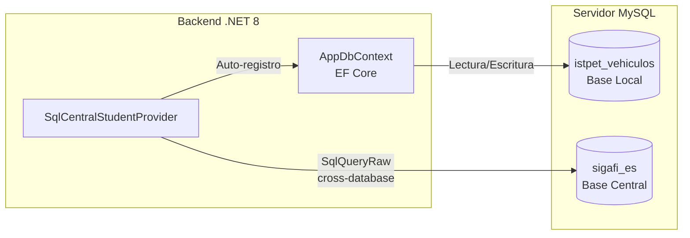

# Integración con la Base de Datos Central SIGAFI — ISTPET

## Contexto

El ISTPET opera dos sistemas de bases de datos independientes en el mismo servidor MySQL:

| Base de Datos | Propósito | Propiedad |
| :--- | :--- | :--- |
| `istpet_vehiculos` | Sistema de logística de prácticas de manejo | Este proyecto |
| `sigafi_es` | Sistema académico central institucional | SIGAFI (externo) |

El sistema de logística se integra con SIGAFI mediante **consultas SQL cross-database** (cross-schema queries en MySQL). Esto elimina la necesidad de APIs intermedias y permite acceder a datos académicos en tiempo real.

---

## Arquitectura de la Integración



El acceso es **solo lectura** hacia SIGAFI — el sistema nunca escribe en la base central.

---

## Tablas de SIGAFI Consultadas

### `sigafi_es.alumnos`
```
idAlumno       VARCHAR(15) -- Cédula del estudiante
primerNombre   VARCHAR(50)
segundoNombre  VARCHAR(50)
apellidoPaterno VARCHAR(50)
apellidoMaterno VARCHAR(50)
celular        VARCHAR(15)
email          VARCHAR(100)
foto           LONGBLOB    -- Foto del alumno en binario (Base64 en respuesta)
```

### `sigafi_es.profesores`
```
idProfesor     VARCHAR(15) -- Cédula del profesor
primerNombre   VARCHAR(50)
segundoNombre  VARCHAR(50)
primerApellido VARCHAR(50)
segundoApellido VARCHAR(50)
activo         INT (1=activo)
```

### `sigafi_es.matriculas`
```
idMatricula    INT
idAlumno       VARCHAR(15) -- FK -> alumnos
idPeriodo      INT         -- FK -> periodos
idNivel        INT         -- FK -> cursos
idSeccion      INT         -- FK -> secciones
paralelo       VARCHAR(5)
valida         INT (1=válida)
```

### `sigafi_es.periodos`
```
idPeriodo      INT
detalle        VARCHAR(50) -- Ej: "OCT2025"
activo         INT (1=período vigente)
```

### `sigafi_es.cursos`
```
idNivel        INT
nombre         VARCHAR(100) -- Ej: "DESARROLLO DE SOFTWARE CUARTO"
```

### `sigafi_es.secciones`
```
idSeccion      INT
nombre         VARCHAR(50) -- MATUTINA, NOCTURNA, FIN DE SEMANA
```

### `sigafi_es.cond_alumnos_practicas` (Agenda Diaria)
Tabla para las prácticas de conducción agendadas para un día específico.
```
idPractica     INT PK
idalumno       VARCHAR(15) -- FK -> alumnos
idvehiculo     INT         -- FK -> vehiculo
idProfesor     VARCHAR(15) -- FK -> profesores
fecha          DATE        -- Filtro CURDATE()
hora_salida    TIME
cancelado      INT (0=vigente)
```

### `sigafi_es.cond_alumnos_vehiculos` (Tutores Asignados)
Tabla que define el instructor responsable y vehículo fijo asignado a un estudiante para todo el curso.
```
idAsignacion   INT PK
idAlumno       VARCHAR(15) -- FK -> alumnos
idVehiculo     INT         -- FK -> vehiculo
idPeriodo      INT
idProfesor     VARCHAR(15) -- FK -> profesores
activa         INT (1=asignación vigente)
```

### `sigafi_es.vehiculo`
```
IdVehiculo     INT
NumeroVehiculo INT
Placa          VARCHAR(15)
Marca          VARCHAR(50)
Modelo         VARCHAR(50)
```

---

## Queries Cross-Database Implementados

### 1. Búsqueda de Estudiante (Puente Híbrido)
Ejecutado por `SqlCentralStudentProvider.GetFromCentralAsync(cedula)`.

```sql
SELECT
    a.idAlumno          AS Cedula,
    a.primerNombre      AS Nombres,
    a.apellidoPaterno   AS Apellidos,
    m.paralelo          AS Paralelo,
    s.nombre            AS Jornada,
    CONCAT_WS(' ', a.apellidoPaterno, a.apellidoMaterno,
              a.primerNombre, a.segundoNombre) AS NombreCompleto,
    CONCAT(c.nombre, ', PARALELO:', m.paralelo, ' ', s.nombre) AS DetalleRaw,
    c.nombre            AS CursoDetalle,
    CAST(p.idPeriodo AS CHAR) AS Periodo,
    TO_BASE64(a.foto)   AS FotoBase64
FROM sigafi_es.alumnos a
JOIN sigafi_es.matriculas m  ON m.idAlumno = a.idAlumno
JOIN sigafi_es.periodos p    ON p.idPeriodo = m.idPeriodo
LEFT JOIN sigafi_es.cursos c ON c.idNivel = m.idNivel
LEFT JOIN sigafi_es.secciones s ON s.idSeccion = m.idSeccion
WHERE a.idAlumno = @cedula AND p.activo = 1
LIMIT 1;
```

### 2. Detección de Tutor Asignado (Fixed Assignment)
Ejecutado por `GetAssignedTutorAsync(cedula)` si no hay práctica agendada hoy.

```sql
SELECT
    p.idProfesor        AS Cedula,
    CONCAT_WS(' ', p.primerNombre, p.segundoNombre) AS Nombres,
    CONCAT_WS(' ', p.primerApellido, p.segundoApellido) AS Apellidos
FROM sigafi_es.cond_alumnos_vehiculos v
JOIN sigafi_es.profesores p ON p.idProfesor = v.idProfesor
WHERE v.idAlumno = @cedula AND v.activa = 1
LIMIT 1;
```

### 3. Práctica Agendada para Hoy (Daily Schedule)
Ejecutado por `GetScheduledPracticeAsync(cedula)`. Posee prioridad sobre el Tutor Asignado.

```sql
SELECT
    p.idPractica        AS IdPractica,
    p.idalumno          AS CedulaAlumno,
    p.idvehiculo        AS IdVehiculo,
    CONCAT_WS(' ', a.apellidoPaterno, a.apellidoMaterno,
              a.primerNombre, a.segundoNombre) AS AlumnoNombre,
    p.idProfesor        AS CedulaProfesor,
    p.hora_salida       AS HoraSalida,
    CONCAT('#', v.NumeroVehiculo, ' (', v.Placa, ')') AS VehiculoDetalle,
    CONCAT_WS(' ', pr.primerApellido, pr.segundoApellido, 
              pr.primerNombre, pr.segundoNombre) AS ProfesorNombre
FROM sigafi_es.cond_alumnos_practicas p
JOIN sigafi_es.alumnos a     ON a.idAlumno = p.idalumno
JOIN sigafi_es.vehiculo v    ON v.IdVehiculo = p.idvehiculo
JOIN sigafi_es.profesores pr ON pr.idProfesor = p.idProfesor
WHERE p.idalumno = @cedula AND p.fecha = CURDATE()
LIMIT 1;
```

### 4. Agenda Completa del Día
Ejecutado por `GetSchedulesForTodayAsync()` para el widget "Agenda SIGAFI Hoy" del panel lateral.

Similar al anterior pero sin filtro de cédula, devuelve todas las prácticas del día.

---

## Comportamiento ante Fallos de la BD Central

El sistema está diseñado con **resiliencia total**: si la base de datos SIGAFI no está disponible (servidor caído, permisos revocados, timeout), todos los métodos de `SqlCentralStudentProvider` capturan la excepción y retornan `null` o lista vacía. El sistema de logística de `istpet_vehiculos` continúa funcionando con los datos locales sin interrupciones.

---

## Configuración del Usuario MySQL

El usuario de base de datos configurado en `appsettings.json` debe tener permisos `SELECT` sobre ambas bases de datos:

```sql
GRANT SELECT ON sigafi_es.* TO 'istpet_user'@'localhost';
GRANT ALL PRIVILEGES ON istpet_vehiculos.* TO 'istpet_user'@'localhost';
FLUSH PRIVILEGES;
```

---

## Script de Simulación (Laboratorio)

Para desarrollo y pruebas sin acceso al servidor real de SIGAFI, ejecutar:

```sql
SOURCE docs/Scripts/MOCK_SIGAFI_ES.sql;
```

Este script crea la base de datos `sigafi_es` con estructura y datos de prueba, incluyendo:
- Alumnos históricos y vigentes (`1725555377`, `1750000002`).
- Profesores e Instructores registrados en SIGAFI.
- Flota de vehículos de prueba.
- **Tutorías asignadas** en `cond_alumnos_vehiculos`.
- **Prácticas agendadas** en `cond_alumnos_practicas` vinculadas al día actual (`CURDATE()`).
