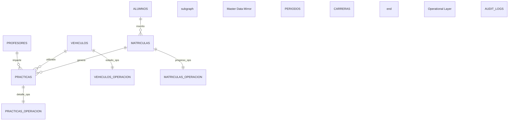

# Arquitectura de Datos y Matriz de Paridad

Este documento detalla la estructura de la base de datos `istpet_vehiculos` y su relación simbiótica con el núcleo académico SIGAFI. El sistema implementa una **Política de Espejo Estricto (Mirroring)** para garantizar la integridad y el rendimiento local.

---

## 1. Política de Paridad SIGAFI 2026

Para asegurar que la logística no dependa de la latencia del servidor central, el sistema se rige por las siguientes reglas:

1.  **Fuente de Verdad**: SIGAFI (`sigafi_es`) es el origen único de datos maestros.
2.  **Aislamiento de Escritura**: La aplicación **nunca** escribe en SIGAFI. Todos los registros operativos se graban localmente.
3.  **Tablas Espejo (Mirror Tables)**: Réplicas exactas de SIGAFI (sin BLOBs de fotos) para optimizar búsquedas.
4.  **Tablas Operativas (Ops Tables)**: Tablas con sufijo `_operacion` que almacenan el estado local sin alterar el espejo institucional.

---

## 2. Clasificación de Entidades

### 2.1. Entidades en Espejo (ReadOnly Mirror)
Sincronizadas mediante el motor **Master Sync**:
*   `alumnos`, `profesores`, `usuarios_web`.
*   `periodos`, `carreras`, `cursos`, `secciones`, `modalidades`.
*   `matriculas`, `cond_alumnos_practicas`, `cond_alumnos_vehiculos`.
*   `vehiculos`, `categoria_vehiculos`, `categorias_examenes_conduccion`.
*   `cond_alumnos_horarios`, `fechas_horarios`.

### 2.2. Entidades Operativas Locales (Write-Heavy)
Almacenan la lógica de negocio propia de la aplicación de logística:
*   `vehiculos_operacion`: Estado mecánico y mapeo de licencias locales.
*   `matriculas_operacion`: Control de horas acumuladas y estado de aprobación.
*   `practicas_operacion`: Observaciones granulares del guardia o instructor.
*   `audit_logs`: Registro histórico de IPs, usuarios y transacciones.

---

## 3. Diagrama Entidad-Relación (Ecosistema Mirroring)

---

## 4. Vistas de Inteligencia Operativa

El sistema utiliza vistas SQL para el monitoreo en tiempo real (Mission Control):

### `v_clases_activas`
Calcula qué vehículos han salido pero no han registrado llegada, cruzando datos de alumnos e instructores.
*   **Uso**: Dashboard principal y pestaña de "Registro de Llegada".

### `v_alerta_mantenimiento`
Identifica unidades con bandera de inactividad o fallos mecánicos reportados en la capa operativa.
*   **Uso**: Advertencias visuales en el selector de vehículos del guardia.

---

## 5. El Protocolo Schema Healer

La base de datos se autogestiona mediante el código en `Program.cs`. En cada arranque:
1.  **Exploración**: Verifica la existencia de las 32 tablas y 4 vistas.
2.  **Reparación**: Si falta una tabla (ej. por un despliegue limpio), el sistema ejecuta el DDL necesario instantáneamente.
3.  **Bootstrap**: Si la tabla de usuarios está vacía, inyecta las credenciales de administración por defecto y los tipos de licencia base.

---

## 6. Auditoría de Datos (Audit Ledger)

Cada transacción crítica escribe en `audit_logs`:
| Campo | Propósito |
| :--- | :--- |
| `User` | Quién realizó la acción (ID o Username) |
| `Action` | Descripción técnica (LOGIN, CHECK_IN, CHECK_OUT) |
| `IP` | Dirección origen de la petición |
| `Metadata` | Detalles JSON de la carga (payload) |
| `Timestamp` | Marca de tiempo UTC para trazabilidad forense |
