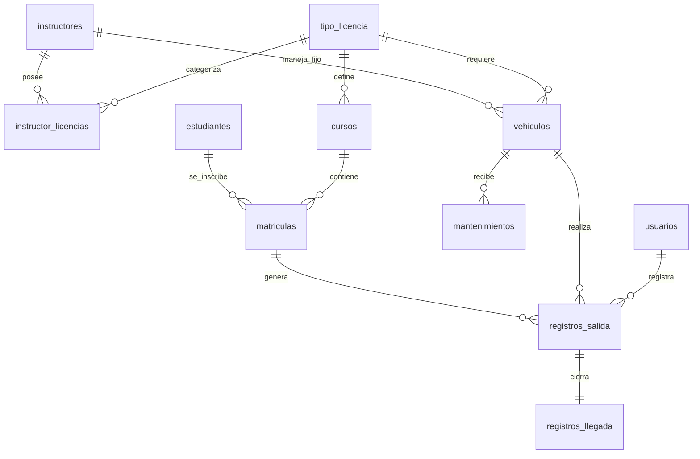

# Gestión de Base de Datos: ISTPET

Este documento describe la estructura de datos, el mapeo de Entity Framework y los objetos de base de datos especializados.

## Visualización de Datos (ERD)

## Esquema Original (11 Tablas)
El sistema cumple estrictamente con el script SQL `istpet_vehiculos`, mapeando las siguientes entidades:

1.  **usuarios**: Control de acceso con roles (admin, guardia).
2.  **tipo_licencia**: Catálogo maestro de licencias C, D, E.
3.  **instructores**: Identificación de los conductores docentes.
4.  **instructor_licencias**: Relación de licencias habilitadas por instructor.
5.  **vehiculos**: Catálogo de unidades con control de kilometraje y estado.
6.  **mantenimientos**: Registro histórico de ingresos al taller.
7.  **cursos**: Relación de niveles y paralelos.
8.  **estudiantes**: Datos personales detallados de los alumnos.
9.  **matriculas**: Vínculo entre estudiantes y cursos.
10. **registros_salida**: Logística de salida de unidades (Trigger SP).
11. **registros_llegada**: Control de retorno y kilometraje (Trigger SP).

## Objetos Especializados SQL

### Vistas SQL (Real-time monitoring)
El sistema consume dos vistas para el Dashboard de monitoreo:
- **`v_clases_activas`**: Muestra qué vehículos están en ruta actualmente con el alumno y el instructor.
- **`v_alerta_mantenimiento`**: Alerta temprana basada en el kilometraje para prevenir fallos mecánicos.

### Procedimientos Almacenados (Integridad de Negocio)
El sistema utiliza `sp_registrar_salida` y `sp_registrar_llegada` para invocar la lógica SQL directamente. Esto asegura que si una salida se intenta realizar con un vehículo ya ocupado, la base de datos la rechace de forma atómica.

## Mapeo Fluent API (.NET 8)
Para evitar discrepancias entre los nombres en C# y los nombres en español de MySQL:
- Se utiliza el mapeo `ToTable("nombre_original")`.
- Se mapean las columnas usando `HasColumnName("columna_original")`.
- **Primary Keys**: Se definieron todas las llaves primarias y foráneas para asegurar la integridad referencial.
- **Keyless Entities**: Las vistas se mapearon como entidades sin llave para permitir consultas de solo lectura súper rápidas.

## Sincronización e Integridad de Datos

### Sincronización Inteligente de Estudiantes
El sistema implementa un mecanismo de "succión" de datos desde la **Base de Datos Central del ISTPET** para maximizar la eficiencia en las garitas:
1.  **Búsqueda Local**: Se prioriza la consulta en las tablas locales para máxima velocidad.
2.  **Puente Central (Real-time Bridge)**: Si el alumno no existe localmente, el sistema consulta la base académica central mediante SQL directo.
3.  **Persistencia Automática**: Una vez localizado el alumno en la central, sus datos se **guardan permanentemente** en las tablas locales (`estudiantes` y `matriculas`). Esto asegura que el sistema siga funcionando incluso si la conexión con la base central se interrumpe en el futuro.

## Evolución y Migraciones
El sistema está preparado para **EF Core Migrations**. Esto significa que si necesitas agregar un campo a una tabla, puedes hacerlo desde C# y el sistema generará el SQL necesario para actualizar MySQL sin errores manuales.
