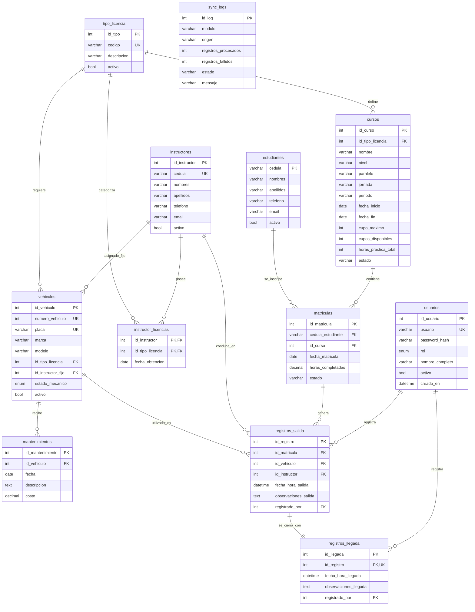

# Base de Datos — ISTPET Logística

Base de datos: `istpet_vehiculos` | Motor: MySQL / MariaDB | Cotejamiento: `utf8mb4_spanish_ci`

---

## Diagrama Entidad-Relación (ERD)



---

## Descripción de Tablas

### Grupo 1: Seguridad y Acceso

#### `usuarios`
Credenciales y roles del personal que opera el sistema.

| Campo | Tipo | Descripción |
| :--- | :--- | :--- |
| `id_usuario` | INT PK | Identificador auto-incremental |
| `usuario` | VARCHAR(50) UNIQUE | Nombre de usuario para el login |
| `password_hash` | VARCHAR(255) | Hash SHA-256 o BCrypt según el origen del usuario |
| `rol` | ENUM | `admin`, `guardia`, `estacionable` |
| `nombre_completo` | VARCHAR(100) | Nombre para mostrar en la interfaz |
| `activo` | TINYINT(1) | Control de acceso (soft delete) |

---

### Grupo 2: Parametrización

#### `tipo_licencia`
Catálogo maestro de categorías de licencias de conducción.

| Código | Descripción |
| :--- | :--- |
| `C` | Profesional — Taxis y autos livianos |
| `D` | Profesional — Buses de pasajeros |
| `E` | Profesional — Camiones y carga pesada |

---

### Grupo 3: Recursos Humanos

#### `instructores`
Datos del personal docente que conduce junto a los estudiantes.

#### `instructor_licencias`
Tabla de relación N:N entre instructores y tipos de licencia que poseen. Permite que un instructor esté habilitado para múltiples categorías.

---

### Grupo 4: Gestión de Flota

#### `vehiculos`
Catálogo de unidades de la escuela.

| Campo | Tipo | Descripción |
| :--- | :--- | :--- |
| `numero_vehiculo` | INT UNIQUE | Número de identificación interno de la unidad |
| `placa` | VARCHAR(15) UNIQUE | Placa de circulación |
| `id_tipo_licencia` | FK | Licencia requerida para conducirlo |
| `id_instructor_fijo` | FK | Instructor titular asignado a la unidad |
| `estado_mecanico` | ENUM | `OPERATIVO`, `MANTENIMIENTO`, `FUERA_SERVICIO` |

#### `mantenimientos`
Historial de ingresos al taller de cada vehículo.

---

### Grupo 5: Académico

#### `cursos`
Representación de los grupos de estudio activos en la escuela.

| Campo | Descripción |
| :--- | :--- |
| `nivel` | Nivel del curso (INICIAL, INTERMEDIO, AVANZADO) |
| `paralelo` | Identificador de paralelo (A, B, C...) |
| `jornada` | MATUTINA, VESPERTINA, NOCTURNA |
| `cupos_disponibles` | Se decrementa automáticamente al auto-registrar estudiantes |
| `horas_practica_total` | Horas de práctica de manejo requeridas para aprobar |
| `estado` | `ACTIVO`, `CERRADO`, `SUSPENDIDO` |

#### `estudiantes`
Datos personales de los alumnos. La cédula es la llave primaria (sin auto-incremental), lo que garantiza unicidad institucional.

#### `matriculas`
Vincula un estudiante con un curso. El campo `horas_completadas` se **actualiza automáticamente** en C# cada vez que se registra una llegada, calculando la duración real (`fecha_hora_llegada - fecha_hora_salida`).

---

### Grupo 6: Control Logístico

#### `registros_salida`
Núcleo operativo. Cada registro representa la salida de un vehículo con un estudiante y un instructor en un momento dado.

#### `registros_llegada`
Cierra un `registro_salida`. La relación es **1:1 con unique constraint** en `id_registro`, lo que garantiza que una salida solo puede tener un retorno. Un vehículo se considera "en pista" si tiene un `registro_salida` sin su correspondiente `registro_llegada`.

---

### Grupo 7: Auditoría

#### `sync_logs`
Registro de cada operación de ingesta masiva ejecutada via `POST /api/sync/students`. Almacena cuántos registros fueron procesados, cuántos fallaron y el motivo.

---

## Vistas SQL

### `v_clases_activas`
Muestra en tiempo real todos los vehículos que están actualmente en pista. Un vehículo aparece en esta vista mientras tenga un `registro_salida` sin `registro_llegada` asociado.

```sql
SELECT rs.id_registro, v.id_vehiculo, e.cedula,
       CONCAT(e.nombres, ' ', e.apellidos) AS estudiante,
       v.placa, v.numero_vehiculo,
       CONCAT(ins.nombres, ' ', ins.apellidos) AS instructor,
       rs.fecha_hora_salida AS salida
FROM registros_salida rs
JOIN matriculas m ON rs.id_matricula = m.id_matricula
JOIN estudiantes e ON m.cedula_estudiante = e.cedula
JOIN vehiculos v ON rs.id_vehiculo = v.id_vehiculo
JOIN instructores ins ON rs.id_instructor = ins.id_instructor
LEFT JOIN registros_llegada rl ON rs.id_registro = rl.id_registro
WHERE rl.id_llegada IS NULL;
```

### `v_alerta_mantenimiento`
Lista todos los vehículos cuyo `estado_mecanico` es `'MANTENIMIENTO'`.

---

## Usuario Administrador Inicial

```sql
-- Usuario: admin_istpet
-- Contraseña: istpet2026
INSERT INTO usuarios (usuario, password_hash, rol, nombre_completo)
VALUES ('admin_istpet', SHA2('istpet2026', 256), 'admin', 'Administrador General ISTPET');
```

> **Nota de Seguridad:** Cambiar la contraseña del administrador inmediatamente después de la instalación.
