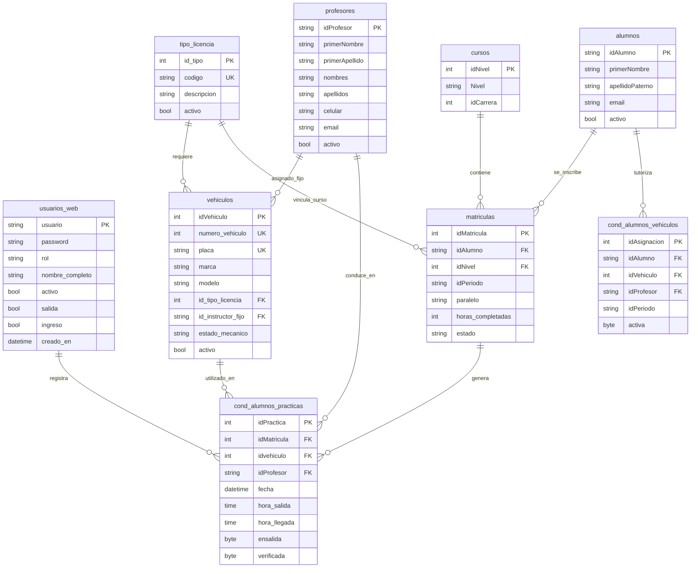

# Base de Datos — ISTPET Logística

Base de datos: `istpet_vehiculos` | Motor: MySQL / MariaDB | Cotejamiento: `utf8mb4_spanish_ci`

---

## Diagrama Entidad-Relación (ERD)



---

## Descripción de Tablas

### Grupo 1: Seguridad y Acceso

#### `usuarios_web`
Credenciales y roles del personal que opera el sistema. Sincronizado directamente con la tabla central de usuarios de SIGAFI.

| Campo | Tipo | Descripción |
| :--- | :--- | :--- |
| `usuario` | VARCHAR PK | Nombre de usuario (Cédula o Login) |
| `password` | VARCHAR | Hash SHA-256 o BCrypt según el origen |
| `rol` | VARCHAR | `admin`, `guardia`, `estacionable` |
| `salida` | BOOL | Permiso para registrar salidas |
| `ingreso` | BOOL | Permiso para registrar llegadas |
| `activo` | BOOL | Control de acceso activo |

---

### Grupo 2: Parametrización

#### `tipo_licencia`
Catálogo maestro de categorías de licencias de conducción.

| Código | Descripción |
| :--- | :--- |
| `C` | Profesional — Taxis y autos livianos |
| `D` | Profesional — Buses de pasajeros |
| `E` | Profesional — Camiones y carga pesada |

---

### Grupo 3: Recursos Humanos

#### `profesores`
Datos del personal docente e instructores de conducción. Mapeado 1:1 con la tabla `profesores` de SIGAFI.

---

### Grupo 4: Gestión de Flota

#### `vehiculos`
Catálogo de unidades de la escuela.

| Campo | Tipo | Descripción |
| :--- | :--- | :--- |
| `idVehiculo` | INT PK | Corresponde al IdVehiculo de SIGAFI |
| `numero_vehiculo` | INT | Número interno (Eco) |
| `placa` | VARCHAR | Placa de circulación |
| `id_tipo_licencia` | FK | Licencia requerida |
| `id_instructor_fijo`| FK | Instructor titular asignada |
| `estado_mecanico` | VARCHAR | `OPERATIVO`, `MANTENIMIENTO` |

#### `mantenimientos`
Historial de ingresos al taller de cada vehículo.

---

### Grupo 5: Académico

#### `cursos`
Mapeado a la tabla `cursos` de SIGAFI. Define los niveles académicos.

| Campo | Descripción |
| :--- | :--- |
| `idNivel` | Identificador único del nivel |
| `Nivel` | Nombre descriptivo del curso |

#### `alumnos`
Mapeado a `alumnos` de SIGAFI. Los estudiantes se auto-registran localmente al ser consultados.

#### `matriculas`
Vincula un estudiante con su curso actual. Almacena las `horas_completadas` de práctica calculadas en cada retorno.

---

### Grupo 6: Control Logístico (Operativo)

#### `cond_alumnos_practicas`
Tabla central donde se registran las salidas y llegadas diarias. Equivale al libro de control de pista.

#### `cond_alumnos_vehiculos`
Asignaciones de tutoría y vehículo fijo para el periodo académico vigente.

---

### Grupo 7: Auditoría

#### `sync_logs`
Registro de cada operación de ingesta masiva ejecutada via `POST /api/sync/students`. Almacena cuántos registros fueron procesados, cuántos fallaron y el motivo.

---

## Vistas SQL

### `v_clases_activas`
Muestra en tiempo real todos los vehículos que están actualmente en pista.

```sql
SELECT cp.idPractica AS id_registro, v.idVehiculo AS id_vehiculo, a.idAlumno,
       CONCAT(a.primerNombre, ' ', a.apellidoPaterno) AS estudiante,
       v.placa, v.numero_vehiculo,
       CONCAT(p.primerNombre, ' ', p.primerApellido) AS instructor,
       cp.fecha AS salida
FROM cond_alumnos_practicas cp
JOIN matriculas m ON cp.idMatricula = m.idMatricula
JOIN alumnos a ON m.idAlumno = a.idAlumno
JOIN vehiculos v ON cp.idvehiculo = v.idVehiculo
JOIN profesores p ON cp.idProfesor = p.idProfesor
WHERE cp.hora_llegada IS NULL AND cp.cancelado = 0;
```

### `v_alerta_mantenimiento`
Lista todos los vehículos cuyo `estado_mecanico` es `'MANTENIMIENTO'`.

---

## Usuario Administrador Inicial

```sql
-- Usuario: admin_istpet
-- Contraseña: istpet2026
INSERT INTO usuarios_web (usuario, password, rol, nombre_completo, activo)
VALUES ('admin_istpet', 'istpet2026', 'admin', 'Administrador General ISTPET', 1);
```

> **Nota de Seguridad:** Cambiar la contraseña del administrador inmediatamente después de la instalación.
