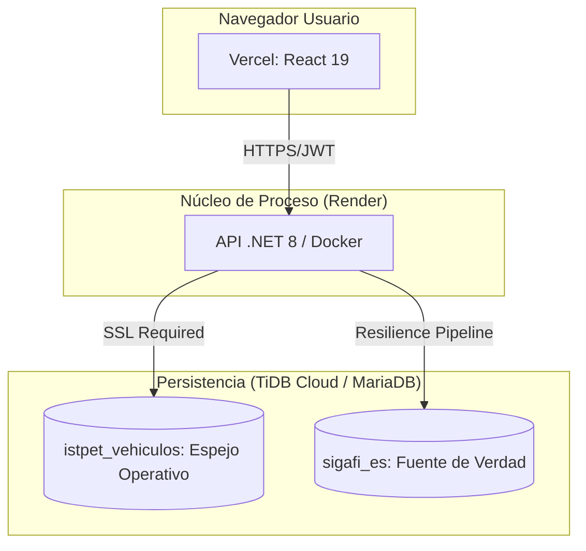

# Estrategia de Despliegue en la Nube (Industrial Grade)

Este documento detalla el despliegue del sistema ISTPET Vehículos utilizando una arquitectura de microservicios distribuida entre **Vercel** (Frontend), **Render** (Backend API) y **TiDB Cloud** (Persistencia Distribuida).

---

## 1. Arquitectura de Despliegue Híbrida

El sistema soporta el **Puente Híbrido Universal** mediante tres estrategias de conectividad:

---

## 2. Persistencia: TiDB Cloud

Para entornos de alta disponibilidad, se recomienda TiDB Cloud (MySQL Compatible).

### 2.1. Hardening de Conexión
El sistema detecta automáticamente si el host es `tidbcloud.com` y **fuerza el uso de SSL de 256 bits**.
*   **DefaultConnection**: Apunta a `istpet_vehiculos`.
*   **SigafiConnection**: Puede apuntar a una réplica de SIGAFI en el mismo clúster o a un túnel de datos.

---

## 3. API Core: Render (Dockerizado)

El backend debe desplegarse como un **Web Service** utilizando el `Dockerfile` optimizado en la raíz de `backend/`.

### Variables de Entorno Críticas:
| Variable | Descripción |
| :--- | :--- |
| `CONNECTIONSTRINGS__DEFAULTCONNECTION` | Cadena SSL para el espejo local. |
| `CONNECTIONSTRINGS__SIGAFICONNECTION` | Cadena para el Puente de Verdad SIGAFI. |
| `JWT__KEY` | Llave de cifrado simétrico (Mínimo 32 chars). |
| `ASPNETCORE_ENVIRONMENT` | Configurar como `Production`. |
| `PORT` | Render inyecta este valor dinámicamente. |

---

## 4. Frontend: Vercel (Producción)

Despliegue de Single Page Application (SPA).

1.  **Configuración de Origen**: Raíz del proyecto en la carpeta `frontend/`.
2.  **Comando de Construcción**: `npm run build`
3.  **Variable VITE**: `VITE_API_URL` debe apuntar a la URL de Render (ej: `https://istpet-api.onrender.com/api`).

---

## 5. Modos de Operación del Puente Híbrido

### A. Modo Réplica (Recomendado Staging)
Ambas bases de datos residen en el mismo clúster de nube. Se sincronizan mediante el motor **Master Sync** de la aplicación.

### B. Modo Túnel (Producción Industrial)
La `SigafiConnection` se establece mediante un túnel (p. ej. Cloudflare Tunnel o VPN Site-to-Site) hacia el servidor MySQL institucional on-premise.

### C. Modo Mock (Demostración)
Se utiliza una base de datos `sigafi_es` mínima generada por el script `MOCK_SIGAFI_ES.sql`, permitiendo mostrar las capacidades del puente sin datos sensibles.

---

## 6. Monitoreo Post-Despliegue

Una vez en línea, valide la salud del sistema mediante el endpoint de diagnóstico:
`GET /api/sync/db-diag`
Este endpoint retornará información técnica sobre el servidor, la base de datos conectada y el estado del enlace, permitiendo descartar errores de configuración de red en segundos.
