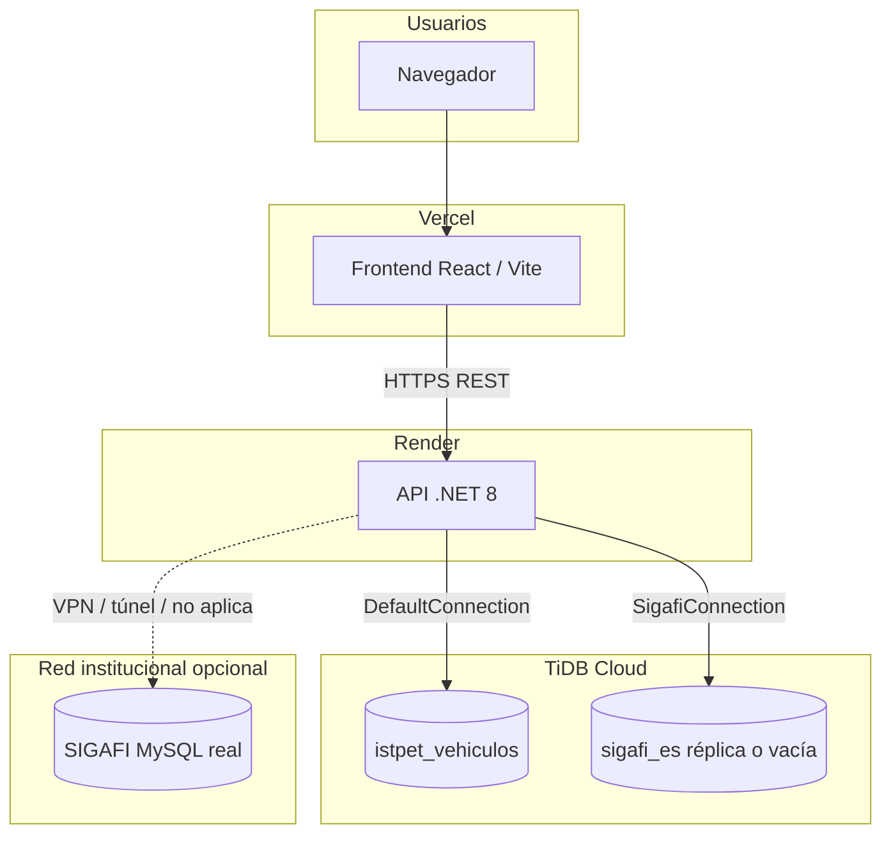

# Despliegue en la nube — Render, Vercel y TiDB Cloud

Guía actual del modelo **después** de alinear scripts y API (Master Sync, dos cadenas de conexión, `99` solo como demo).

---

## Arquitectura recomendada

| Pieza | Rol |
| :--- | :--- |
| **Vercel** | Sirve el **frontend** estático (build de Vite). No ejecuta la API. |
| **Render** | Sirve la **API** (.NET). El `Dockerfile` en `backend/` expone el puerto que Render inyecta (`PORT` / `8080`). |
| **TiDB Cloud** | MySQL-compatible: aloja **`istpet_vehiculos`** (obligatorio). Opcionalmente una segunda base **`sigafi_es`** en el **mismo clúster** si no hay enlace al SIGAFI real. |

---

## Punto crítico: `SigafiConnection`

La API **siempre** puede usar dos BDs:

- **`DefaultConnection`** → `istpet_vehiculos` (espejo + escrituras de logística).
- **`SigafiConnection`** → lectura tipo SIGAFI (`sigafi_es`).

En **campus** (192.168.x), ambas suelen estar en el mismo MySQL interno. En **Render**, ese servidor **no es alcanzable** desde internet salvo que montes **VPN, túnel (p. ej. Cloudflare Tunnel)** o **IP pública + firewall** muy controlado.

**Tres modos de operación en nube:**

1. **Réplica de SIGAFI en TiDB**  
   Mantienes en TiDB dos bases: `istpet_vehiculos` y `sigafi_es`, y cargas `sigafi_es` con export/import periódico desde el servidor real (ETL, mysqldump, job interno).  
   `SigafiConnection` apunta al TiDB. El **Master Sync** y el **probe** funcionan igual que en local.

2. **Solo espejo en TiDB (sin SIGAFI vivo)**  
   Solo `istpet_vehiculos` en TiDB; `SigafiConnection` apunta a la **misma** instancia y a una BD `sigafi_es` **vacía o mínima** (mock).  
   La app arranca, pero **login contra usuarios SIGAFI**, **probe** y **sync desde SIGAFI real** no tendrán datos reales. Útil solo para demos UI.

3. **Túnel a SIGAFI real**  
   `SigafiConnection` usa host/puerto expuestos vía túnel hasta el MySQL institucional. Es lo más fiel operativamente; depende de infraestructura de red.

---

## TiDB Cloud

1. Crea el clúster y obtén la cadena tipo `Server=...tidbcloud.com;Port=4000;...`
2. El proyecto ya añade **`SslMode=Required`** si la URL contiene `tidbcloud.com` (`Program.cs`).
3. Crea las bases:
   - Ejecuta **`docs/Scripts/01_ISTPET_LOGISTICS_SCHEMA.sql`** contra TiDB para `istpet_vehiculos` (ajusta si tu cliente no permite `DROP DATABASE` en managed).
   - Si usas el modo **réplica**, crea también `sigafi_es` y carga datos; o usa **`Cloud/99_MASTER_DEPLOYMENT.sql`** solo como **laboratorio** y luego sustituye por datos reales.
4. Variables en Render (ver abajo):  
   `ConnectionStrings__DefaultConnection` y `ConnectionStrings__SigafiConnection` (sintaxis de doble guion bajo para anidar JSON en variables de entorno).

---

## Render (API)

- **Tipo:** Web Service (Docker) o build nativo .NET según prefieras; el repo incluye **`backend/Dockerfile`** orientado a contenedor.
- **Build / start:** según plantilla Docker de Render (contexto `backend/`).
- **Variables de entorno mínimas:**

| Variable | Ejemplo de propósito |
| :--- | :--- |
| `ConnectionStrings__DefaultConnection` | TiDB → `istpet_vehiculos` |
| `ConnectionStrings__SigafiConnection` | TiDB → `sigafi_es` **o** túnel al MySQL SIGAFI |
| `JwtSettings__Key` (y resto JWT) | No dejar la clave por defecto en producción |
| `SigafiMirrorSync__Enabled` | `false` si no hay SIGAFI estable desde Render (evita errores en bucle) |

`Program.cs` ya usa **`PORT`** si existe (patrón Render).

Tras desplegar: prueba `GET https://tu-api.onrender.com/swagger` (si dejas Swagger en staging), o `POST /api/Auth/login` y **`/api/Sync/sigafi-probe`** con token admin (ver **`SYNC_VERIFICATION.md`**).

---

## Vercel (frontend)

1. Proyecto con raíz en **`frontend/`** (o monorepo con `root directory` = `frontend`).
2. **Build:** `npm run build`  
3. **Variable de entorno:** `VITE_API_URL=https://tu-servicio.onrender.com/api`  
   (El cliente usa `import.meta.env.VITE_API_URL` en `frontend/src/services/api.js`.)
4. En **Render**, CORS actual es permisivo en desarrollo; en producción conviene restringir orígenes al dominio de Vercel en `Program.cs`.

---

## Relación con el script `Cloud/99_MASTER_DEPLOYMENT.sql`

- Sigue siendo útil para **probar en un MySQL/TiDB vacío** (mock + primer volcado).
- **No** sustituye la ingesta real de producción: para eso está **`01`** + **Master Sync** o tu pipeline de réplica hacia `sigafi_es` en TiDB.

Índice general de scripts: **`docs/Scripts/README.md`**.

---

## Resumen

| Pregunta | Respuesta corta |
| :--- | :--- |
| ¿Dónde va el front? | **Vercel**, con `VITE_API_URL` = URL pública de la API. |
| ¿Dónde va la API? | **Render** (u otro PaaS), con Docker o build .NET. |
| ¿Dónde van los datos? | **TiDB Cloud** para `istpet_vehiculos`; `sigafi_es` en el mismo TiDB (réplica) o acceso vía túnel al SIGAFI real. |
| ¿El `99` es el despliegue oficial? | No; es **demo**. Producción = **`01`** + datos + conexiones bien configuradas. |
