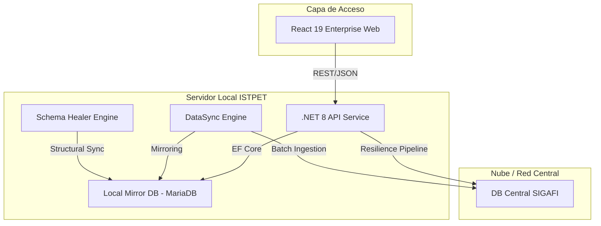
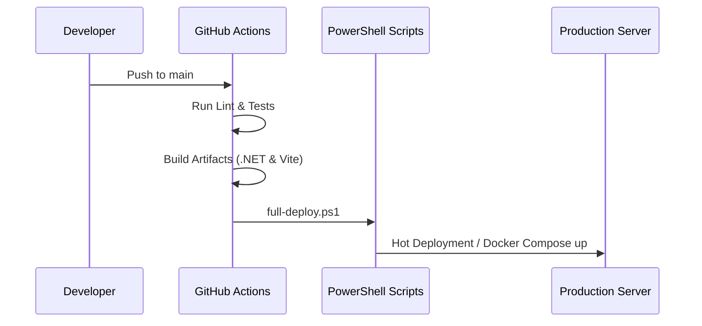

# Especificación Arquitectónica: Sistema Logístico ISTPET (Enterprise Edition)

**Versión:** 2.0.0 — 2026  
**Clasificación:** Confidencial / Uso Interno  
**Estado:** Documento de Ingeniería Certificado  

---

## 1. Resumen Ejecutivo
El Sistema de Gestión Vehicular del ISTPET es una plataforma de misión crítica diseñada para la orquestación logística de la flota institucional. Esta solución de clase empresarial integra capacidades de sincronización híbrida, resiliencia ante fallas de red externa y un motor de auditoría avanzada para garantizar la trazabilidad total de las operaciones.

---

## 2. Visión Arquitectónica: Hybrid Universal Bridge
La arquitectura se fundamenta en el patrón **Universal Bridge**, que permite una transición transparente entre la dependencia de sistemas centrales y la autonomía operativa local.

### 2.1 Topología de Componentes

### 2.2 Estrategias de Resiliencia
*   **Circuit Breaker (Polly):** El sistema monitorea la salud de la conexión SIGAFI. Si los tiempos de respuesta exceden los 5000ms o hay fallos consecutivos, el circuito se abre y el sistema entra en **Modo Supervivencia (Mirror Mode)**.
*   **JIT (Just-In-Time) Synchronization:** Los catálogos críticos se validan en cada búsqueda. Si un registro maestro no existe localmente, el sistema realiza una extracción atómica desde la fuente central antes de permitir la transacción.

---

## 3. Blueprint de Seguridad (Enterprise Security)

### 3.1 Gobernanza de Identidad
*   **Autenticación:** Implementación de JWT (JSON Web Tokens) con algoritmo HS256.
*   **RBAC (Role-Based Access Control):** 
    *   `admin`: Control total y supervisión de auditoría.
    *   `logistica`: Gestión de flota y reportes operativos.
    *   `guardia`: Operaciones de campo (Salida/Llegada).

### 3.2 Trazabilidad y Auditoría
Cualquier mutación de estado (cambio en vehículos, estatus de alumnos, registros de salida) es interceptada por el `SqlAuditService`, registrando el contexto completo:
*   Identidad del operario.
*   Payload de la transacción.
*   Dirección IP de origen.
*   Timestamp de alta precisión.

---

## 4. Ingeniería de Datos y Modelo MIRROR

El sistema mantiene una paridad de 1:1 con las estructuras centrales de SIGAFI mediante un motor de **Mirroring**.

### Modelo de Datos Crítico:
*   **Master Data:** Alumnos, Profesores, Vehículos, Carreras, Niveles.
*   **Operational Data:** Prácticas, Asignaciones, Alertas de Mantenimiento, Logs de Auditoría.

---

## 5. Ecosistema DevOps e Integración Continua (CI/CD)

El sistema utiliza pipelines de automatización para garantizar que cada versión desplegada cumpla con estándares de calidad empresarial.

### 5.1 Calidad de Código (Quality Gates)
*   **Backend:** Verificación de compilación en Release, restauración de dependencias y ejecución de tests unitarios automáticos.
*   **Frontend:** Linting estricto (ESLint 9) y verificación de build de producción con Vite.

### 5.2 Flujo de Despliegue (Pipeline Blueprint)

---

## 6. Guía de Infraestructura y Orquestación

### 6.1 Containerización
El sistema está orquestado mediante **Docker Compose**, separando las responsabilidades en servicios aislados y escalables:
*   `istpet_db`: Motor de base de datos MariaDB 10.11 optimizado para Mirroring.
*   `istpet_backend`: Microservicio .NET 8 con Health Checks integrados.
*   `istpet_frontend`: Servidor Nginx sirviendo la SPA de React optimizada.

### 6.2 Estrategia de Monitoreo
*   **Health Checks:** Endpoint `/health` con reporte detallado de latencia de base de datos.
*   **Operative Alerts:** Monitorización proactiva de vehículos en ruta mediante el `OperativeAlertsContext` con notificaciones push al equipo de seguridad.

---

## 7. Plan de Recuperación ante Desastres (DRP)

1.  **Fallo de SIGAFI:** El sistema cambia automáticamente a la copia local. Los cambios se encolan y se intentará la paridad cuando la conexión se restablezca.
2.  **Corrupción de Base Local:** El `Schema Healer` permite reconstruir la estructura desde cero utilizando los metadatos integrados en los binarios del backend.
3.  **Inconsistencia de Versión:** Los scripts de `build-and-package.ps1` permiten realizar rollbacks rápidos a versiones previas certificadas.

---
*Documento certificado por la Dirección de Tecnología - ISTPET 2026*
