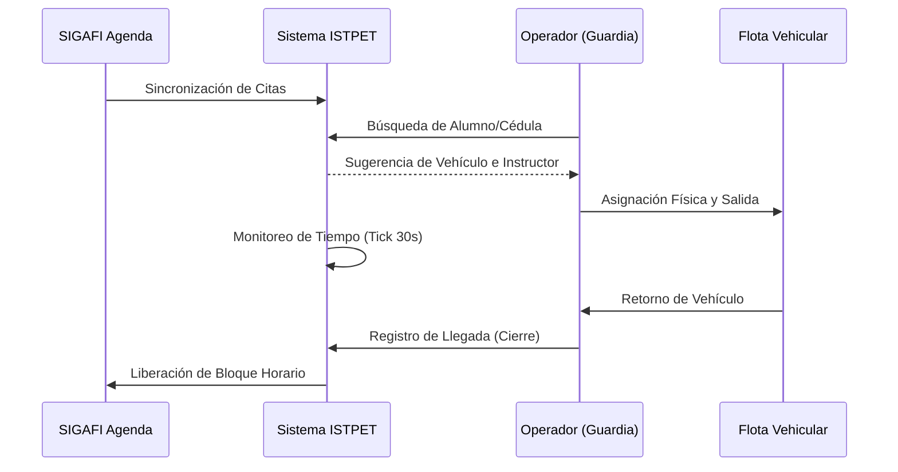

# Especificación Operativa Premium: Sistema de Gestión Vehicular ISTPET

**Versión:** 3.0.0 — 2026  
**Clasificación:** Confidencial / Operaciones Críticas  
**Certificación:** Estándar Industrial ISTPET  

---

## 1. Marco Operativo Enterprise y Matriz de Roles

El sistema opera bajo un modelo de **Control de Acceso Basado en Roles (RBAC)**, asegurando que cada operario interactúe únicamente con las capas de su competencia administrativa.

| Perfil | Dominio Operativo | Herramientas Críticas |
| :--- | :--- | :--- |
| **Administrador** | Gobernanza de Datos y Salud de Sistema | Sync Master, Auditoría de Paridad, Diagnóstico |
| **Logística** | Planificación y Supervisión de Flota | Dashboard, Reportes, Gestión de Alumnos |
| **Guardia** | Ejecución de Campo y Control de Pista | Salida/Llegada, Monitor de Tiempos |

---

## 2. Ciclo de Vida de la Práctica (Workflow Digital)

El proceso operativo sigue una ruta lineal protegida por validaciones de integridad en cada etapa.

---

## 3. Módulo Maestro: Diagnóstico y Salud del Ecosistema

Uso exclusivo para el perfil **Administrador** y **Logística Avanzada**.

### 3.1 Sondeo de SIGAFI (Probe System)
*   **Propósito:** Verificar que los módulos de comunicación con la base de datos central estén operativos.
*   **Acción:** Acceder a "Diagnóstico de Red" y ejecutar **Ping SIGAFI**. Un resultado verde indica latencia menor a 200ms.
*   **Sondeo Atómico (Probe):** Ejecuta una prueba de extracción en frío. Si una tabla (ej. Alumnos o Carreras) falla, el sistema lo marcará en rojo, permitiendo identificar discrepancias de esquema antes de que afecten la operación.

### 3.2 Auditoría de Paridad (Data Integrity)
Permite comparar en tiempo real el conteo de registros entre SIGAFI y el Espejo Local. Una disparidad mayor al 5% en alumnos activos requiere una ejecución de **Master Sync**.

---

## 4. Protocolos de Contingencia: Survival Mode (SIGAFI Offline)

En caso de caída total de la infraestructura central institucional, el sistema entrará automáticamente en **Modo de Supervivencia**.

| Fase | Situación | Procedimiento de Usuario |
| :--- | :--- | :--- |
| **Detección** | Banner Rojo: "SIGAFI No Disponible" | Mantener la calma; el sistema utilizará el espejo local. |
| **Operación** | Búsqueda Manual | Ingrese la cédula. Si no existe en el espejo local, use el botón "Registro Manual Temporal". |
| **Sincronización** | Restablecimiento de Red | El sistema detectará la red y sincronizará los registros encolados automáticamente. |

---

## 5. Simbología, Feedback Visual y UI Experience

Entender "qué está pensando" el sistema es clave para una operación rápida.

### 5.1 Glosario de Badges y Estados
*   🟦 **AZUL (Agendado):** El alumno tiene una cita válida para la hora actual.
*   🟨 **AMARILLO (Sincronizando):** Datos en proceso de actualización desde SIGAFI.
*   🟩 **VERDE (Operativo / Completado):** Acción exitosa y grabada.
*   🟥 **ROJO (En Pista / Busy):** El estudiante o vehículo ya posee una práctica activa.

### 5.2 Skeleton Loaders
Si ve bloques grises pulsantes, el sistema está realizando un **JIT Sync** (Sincronización al vuelo). No recargue la página; los datos aparecerán en menos de 2 segundos.

---

## 6. Mantenimiento Atómico y Sincronización Maestra

Herramientas para sanar la base de datos sin intervención de TI:
1.  **Inspección de Estudiante:** Compare un perfil específico para detectar si la foto o el nivel académico están desactualizados respecto al SIGAFI.
2.  **Master Sync:** Ejecución masiva de ingesta de datos. *Precaución: Este proceso puede ralentizar la búsqueda durante 2-3 minutos.*

---

## 7. Matriz Avanzada de Resolución de Incidencias

| Error Visual | Causa Técnica | Protocolo de Resolución |
| :--- | :--- | :--- |
| **"Error de Paridad Crítico"** | Desfase estructural en DB local. | Ejecute "Limpiar Caché de Datos" y luego "Master Sync". |
| **Vehículo "Fantasma" en Pista** | Llegada no registrada por fallo de red. | Localice el ID de práctica y use "Eliminación Forzada por Auditoría". |
| **Cédula "Rechazada por Escudo"** | Dato malformado en SIGAFI. | Corrija el registro en el sistema central y ejecute "Sync Manual" para ese ID. |

---
*Especificación operativa de grado industrial - Departamento de TI ISTPET 2026*
