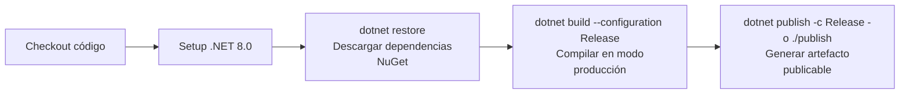
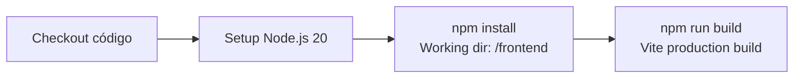

# Pipelines de CI/CD — ISTPET Logística

El repositorio utiliza **GitHub Actions** para automatizar la validación del código en cada `push` o `pull request`.

Archivos de configuración: `.github/workflows/`

---

## Pipeline de Backend

**Archivo:** `.github/workflows/backend-ci.yml`

**Disparadores:**
- `push` a las ramas `main` o `develop` con cambios dentro de `backend/**`
- `pull_request` hacia `main` con cambios en `backend/**`

**Entorno de ejecución:** `ubuntu-latest`

### Etapas



| Etapa | Comando | Propósito |
| :--- | :--- | :--- |
| **Checkout** | `actions/checkout@v4` | Obtener el código del repositorio |
| **Setup .NET** | `actions/setup-dotnet@v4` | Instalar .NET 8 en el runner |
| **Restore** | `dotnet restore backend/backend.csproj` | Descargar paquetes NuGet |
| **Build** | `dotnet build --configuration Release` | Compilar y detectar errores de tipo |
| **Publish** | `dotnet publish -c Release -o ./publish` | Generar el artefacto de publicación |

> **Nota:** La etapa de pruebas unitarias está preparada pero no implementada (`echo "Ejecutando pruebas..."`) — está contemplada en el Roadmap.

---

## Pipeline de Frontend

**Archivo:** `.github/workflows/frontend-ci.yml`

**Disparadores:**
- `push` a las ramas `main` o `develop` con cambios dentro de `frontend/**`
- `pull_request` hacia `main` con cambios en `frontend/**`

**Entorno de ejecución:** `ubuntu-latest`

### Etapas



| Etapa | Comando | Propósito |
| :--- | :--- | :--- |
| **Checkout** | `actions/checkout@v4` | Obtener el código del repositorio |
| **Setup Node** | `actions/setup-node@v4` (Node 20) | Instalar Node.js |
| **Install** | `npm install` en `/frontend` | Instalar dependencias de npm |
| **Build** | `npm run build` en `/frontend` | Compilar con Vite y detectar errores de importación |

---

## Estrategia de Ramas

```
main        ← Rama de producción (CI/CD activo)
│
└── develop ← Rama de integración (CI/CD activo)
    │
    └── feature/* ← Ramas de trabajo (sin pipeline directo)
```

Los pipelines se activan **separados por área**: un cambio solo en `backend/` no dispara el pipeline de frontend, y viceversa. Esto reduce el tiempo de ejecución y el consumo de minutos de GitHub Actions.

---

## Resultado de una Ejecución Exitosa

Cuando ambos pipelines pasan en verde, garantiza que:

1. **Backend:** El código C# compila sin errores en modo Release y genera un artefacto publicable.
2. **Frontend:** Las dependencias npm se instalan correctamente y Vite puede construir el bundle de producción sin errores de módulos o importaciones.

---

## Extensiones Futuras (Roadmap)

| Mejora | Descripción |
| :--- | :--- |
| **Pruebas unitarias backend** | Agregar `xUnit` o `NUnit` y reemplazar el `echo` actual |
| **Deploy automático** | Agregar un job de `deploy` que publique a un servidor real tras un push a `main` |
| **Lint en CI** | Ejecutar `npm run lint` como etapa de validación de calidad del código frontend |
| **Análisis de seguridad** | Integrar `dotnet-security-scan` o Dependabot para vulnerabilidades de dependencias |
