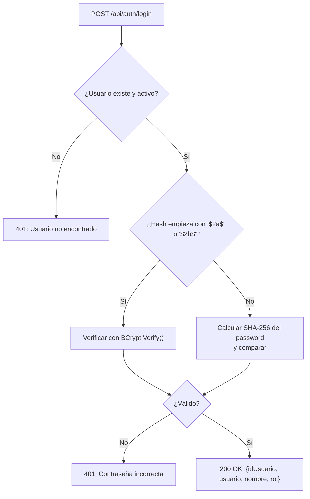
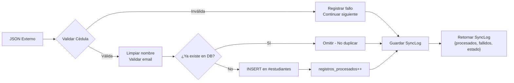

# Seguridad y Protección de Datos — ISTPET

## Modelo de Seguridad

El sistema implementa tres capas de protección independientes:

```
[Capa 1: Autenticación Híbrida]  →  [Capa 2: Middleware de Errores]  →  [Capa 3: Data Shield]
     AuthController                   ErrorHandlingMiddleware              DataValidator + DataSyncService
```

---

## Capa 1: Autenticación — Puente Híbrido de Seguridad

El sistema debe coexistir con usuarios provenientes del sistema SIGAFI (que usan contraseñas hasheadas con **BCrypt**) y usuarios nativos nuevos (que usan **SHA-256**). El `AuthController` detecta automáticamente el algoritmo correcto.



### Hash SHA-256 (Usuarios Nativos)
```sql
-- Así se crea el hash en el SQL inicial:
INSERT INTO usuarios (usuario, password_hash, ...)
VALUES ('admin_istpet', SHA2('istpet2026', 256), ...);
```

### Hash BCrypt (Usuarios Migrados de SIGAFI)
Los usuarios con contraseñas almacenadas como BCrypt en SIGAFI pueden autenticarse directamente sin necesidad de restablecer su contraseña. El sistema detecta el hash por su prefijo `$2a$` o `$2b$`.

> **Nota:** El sistema actual no implementa JWT ni sesiones. La autenticación retorna los datos del usuario para gestión en el frontend. En el Roadmap se contempla la implementación de JWT Bearer Tokens.

---

## Capa 2: Middleware Global de Errores

`ErrorHandlingMiddleware.cs` actúa como el último recurso ante cualquier excepción no controlada. Garantiza que el cliente nunca reciba:
- Mensajes de error de .NET crudos (stack traces)
- Información del servidor o de la base de datos

**Toda excepción no capturada resulta en:**
```json
{
  "success": false,
  "message": "Error interno del servidor. Consulte soporte técnico.",
  "data": null
}
```

El error real se registra en los logs del servidor (`ILogger`) sin exponerlo al cliente.

---

## Capa 3: Data Shield — Sanitización de Datos Externos

Implementado en `DataValidator.cs` y `DataSyncService.cs`. Protege la base de datos ante la ingesta de datos externos de calidad variable (provenientes de sistemas terceros vía `POST /api/sync/students`).

### Reglas de Validación

| Regla | Implementación | Acción si falla |
| :--- | :--- | :--- |
| **Cédula válida** | `Regex: ^\d{10,15}$` | Registro rechazado, `registros_fallidos++` |
| **Email válido** | `Regex: ^[^@\s]+@[^@\s]+\.[^@\s]+$` | Email guardado como `NULL` (campo opcional) |
| **Nombre limpio** | `Regex.Replace(name, @"[^a-zA-Z\s]", "")` | Caracteres especiales eliminados antes de persistir |

### Flujo de Ingesta Protegida



---

## Protección de la BD Central SIGAFI

El acceso a `sigafi_es` es estrictamente de **solo lectura**. El usuario de MySQL configurado solo tiene permisos `SELECT` sobre esa base de datos. Nunca se realizan `INSERT`, `UPDATE` o `DELETE` sobre SIGAFI desde este sistema.

---

## Configuración CORS

En el entorno actual (desarrollo), CORS permite cualquier origen:

```csharp
policy.AllowAnyOrigin().AllowAnyMethod().AllowAnyHeader()
```

> **Para producción:** Restringir a los dominios específicos del frontend.

```csharp
// Ejemplo para producción:
policy.WithOrigins("https://istpet.edu.ec")
      .AllowAnyMethod()
      .AllowAnyHeader();
```

---

## Consideraciones de Producción

| Aspecto | Estado Actual | Recomendación |
| :--- | :--- | :--- |
| Autenticación | Hash directo (sin sesión) | Implementar JWT Bearer Tokens |
| Autorización por rol | No implementada en controladores | Implementar `[Authorize(Roles="admin")]` |
| CORS | `AllowAll` (desarrollo) | Restringir a dominio de producción |
| HTTPS | No forzado | Habilitar `app.UseHttpsRedirection()` |
| Contraseña en config | `appsettings.json` en texto plano | Usar variables de entorno o Azure Key Vault |
